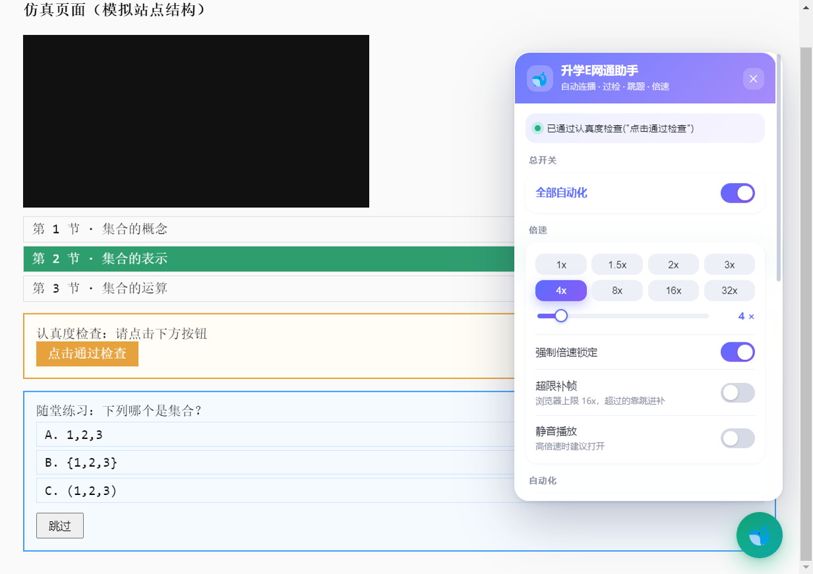

<div align="center">

# 🐋 升学E网通助手

**升学 E 网通网课自动化助手 —— 自动连播 · 自动过认真度检查 · 自动跳过/作答课中选择题 · 强制倍速**

[](LICENSE)
[](#-安装方式)
[](#-安装方式)
[](#-安装方式)



</div>

---

## ✨ 功能

| 功能 | 说明 |
|---|---|
| 🔁 **自动连播** | 播完（或到 85%）自动切下一节；切集后自动恢复播放；没找到下一节会明确告诉你 |
| ✅ **自动过认真度检查** | 弹窗一出现就点掉；能识别说明文字与按钮的区别，不会傻点标题 |
| ⏭️ **自动跳过课中选择题** | 优先点「跳过」；没有跳过按钮就自动作答（智能/第一个/随机/最长四种策略）后再提交 |
| ⚡ **强制倍速** | 从 `HTMLMediaElement.prototype` 根部劫持 setter，**站点改回 1x 也无效**；支持 0.5x–32x（>16x 自动启用补帧） |
| 🛡️ **isTrusted 反检测绕过** | 站点对合成点击做 `isTrusted` 校验时自动放行 |
| 🌙 **后台挂机** | 伪造页面可见性 + 关闭后台节流，切标签/最小化照播 |
| 🎛️ **美化控制面板** | 渐变毛玻璃卡片、可拖动、拖拽位置记忆、深色模式自动适配、`Esc` 收起 |

> 面板里的每一项都能单独开关，配置存在 `localStorage`，刷新不丢。

## 📦 安装方式

四种形态功能完全一致，按你的使用场景挑一个就行。

> 想自己改代码：`git clone https://github.com/Huadiaole/ewt360-helper.git`

### ① 油猴脚本（最省事）

1. 浏览器装 [Tampermonkey](https://www.tampermonkey.net/)；
2. 新建脚本，把 [`src/ewt360-helper.user.js`](src/ewt360-helper.user.js) 的内容整份粘进去保存；
3. 打开 ewt360 课程页，右下角出现 🐋 悬浮球 → 点开面板 → 开启「全部自动化」。

### ② 浏览器扩展（免油猴，也支持安卓 Kiwi）

```powershell
# 桌面：一键用独立配置启动 Edge 并加载扩展
powershell -ExecutionPolicy Bypass -File extension\start-edge.ps1
```

或手动：`edge://extensions` → 开发者模式 → 加载解压缩的扩展 → 选 `extension/` 目录。
安卓端装 **Kiwi Browser** 后同理加载该目录。

### ③ 桌面 EXE（免安装，双击即用）

```powershell
cd desktop
npm install
powershell -NoProfile -ExecutionPolicy Bypass -File .\build-exe.ps1
# 产物：desktop\dist\win-unpacked\升学E网通助手.exe ← 双击它
```

> 桌面版不随 Releases 提供预编译包（Electron 运行时 170MB+），请本地打包一次即可。
> 打包脚本会自动：同步脚本 → 下依赖 → 打包 → 主程序改名 → 编译 139KB 启动器 → 刻图标。

### ④ 安卓 APK

从 [Releases](../../releases) 下载 `EWT360-Helper-<版本>-debug.apk` 安装即可（minSdk 24）。

**自己编译**：

```bash
cd android
gradle assembleDebug          # 或用 Android Studio 打开该目录直接 Run
# 产物：android/app/build/outputs/apk/debug/app-debug.apk
```

## 🚀 快速上手

脚本默认**已全开**：4 倍速 / 自动连播 / 自动跳题 / 自动过检。打开课程页就能挂机了。

想调参数就点右下角 🐋：

- **倍速**：点 1x~32x 胶囊按钮，或拖滑杆精细调（0.5 步进）
- **连播模式**：「播完切换」更稳妥，「85% 切换」更快（有些课尾有弹窗时会卡）
- **答题策略**：「智能」会先找页面里的正确项线索（`data-correct` / `.correct` 之类），找不到才选第一个
- **>16x**：必须打开「超限补帧」——浏览器原生上限是 16x，超出部分靠每 500ms 往前跳时间实现

## 🧠 工作原理

核心脚本只有一份 [`src/ewt360-helper.user.js`](src/ewt360-helper.user.js)，四种形态都是「宿主 + 注入」的壳。

**1. 强制倍速怎么做到「改不回去」的**

```js
const d = Object.getOwnPropertyDescriptor(HTMLMediaElement.prototype, 'playbackRate');
Object.defineProperty(HTMLMediaElement.prototype, 'playbackRate', {
  get() { return d.get.call(this); },
  set(v) { d.set.call(this, self.targetRate()); }   // 站点写什么都强制成我们的值
});
```

再配合 `play` / `playing` / `ratechange` 事件兜底，站点想重置也重置不了。

**2. 为什么命中元素不靠 class 名**

站点用的是构建时哈希类名（`.listCon-zrsBh`、`.item-blpma.active-EI2Hl` 这种，一更新就变）。所以定位逻辑走的是**文本节点级扫描 + 语义打分**：找带 `active` 的列表项、看兄弟节点数量、看 class 里有没有 `item/chapter/lesson`、看有没有 `video` 子节点……命中率稳定得多。

**3. 四形态的注入时机**

| 形态 | 注入方式 |
|---|---|
| 油猴 / 扩展 | `document-start` + `@grant none` / MV3 `world: MAIN` |
| 桌面 EXE | Electron **preload 主世界 eval**（比页面任何脚本都早） |
| 安卓 APK | `shouldInterceptRequest` 拦主文档 → OkHttp 带 Cookie 重拉 → 把脚本内联到 `<head>` 之后（真正的 document-start） |

## 📁 项目结构

```
ewt360-helper/
├─ src/ewt360-helper.user.js      ← 唯一真源（逻辑全在这儿）
├─ extension/                     MV3 扩展（含构建器与图标生成）
├─ desktop/                       Electron 桌面版（含离线仿真测试台）
├─ android/                       Kotlin + WebView 安卓壳
├─ tools/                         图标生成 / APK 构建 / APK 验收
├─ docs/                          截图与图标素材
└─ .github/workflows/build.yml    CI：自动构建扩展与 APK
```

## 🧪 测试

项目自带**离线仿真测试台**（不联网、不碰真实站点）：伪造一个假 ewt360 页面，含假弹窗、假题目、假章节列表，还有「每 300ms 把倍速改回 1x」和「对合成点击做 isTrusted 校验」两处陷阱。

```powershell
cd desktop
npm install
npm test          # 8 项冒烟：注入 / 面板 / 倍速锁死 / 过检 / 跳题 / 连播 / isTrusted
npm run test:exe  # 端到端：启动打包后的真 EXE 跑同一套断言
```

```bash
node tools/inspect-apk.mjs        # APK 验收：结构 + 脚本哈希一致性
```

## ❓ 常见问题

**Q：装完没反应？**
按 `F12` 看 Console 有没有 `[EWT] 升学E网通助手 已启动`。没有就是域名不匹配或注入失败。

**Q：倍速被改回 1x？**
理论上不会。真遇到了请打开面板「详细日志」，把 `[EWT]` 输出贴到 Issues。

**Q：桌面版双击没反应？**
确认点的是 `升学E网通助手.exe`（启动器）而不是 `app.exe`。启动器会在命令行上带 `--no-sandbox` 与 `--user-data-dir`——受限环境下这两条是**必须**的，且无法从 JS 里补（Chromium 在 JS 执行前就定好了沙箱与配置目录）。

**Q：会不会被平台发现？**
本项目的所有操作都在**你自己的浏览器/客户端里**模拟真人操作，不修改、不伪造任何服务端数据。但请自行评估风险，详见免责声明。

## ⚖️ 免责声明

- 本项目仅供**个人学习与技术研究**使用，用于了解用户脚本注入、Electron/WebView 宿主开发等技术。
- 请遵守升学 E 网通的服务条款与所在学校的规章制度，**不要**用本工具刷课、代考或任何形式的作弊。
- 使用产生的一切后果由使用者自行承担，作者不对账号异常、学习记录异常等承担任何责任。
- 本项目与升学 E 网通官方**没有任何关系**，未获得其授权或认可。
- 若权利人认为本项目侵犯其权益，请提 Issue，我们会立即处理。

## 📄 许可证

[MIT](LICENSE)

---

<div align="center"><sub>Made with 🐋 · 用爱发电，请勿滥用</sub></div>
